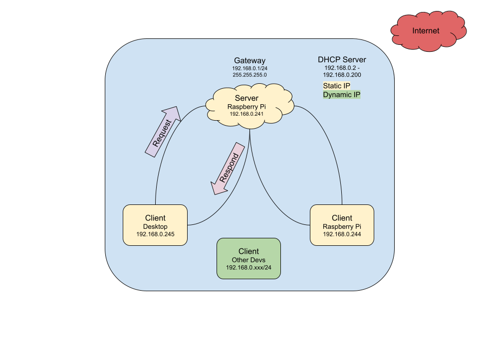

# Socket Programming in C

## Overview

I found myself working between different devices under my network. I currently have my desktop and two Raspbery Pis that I tend to transfer different files from one play to another via using `scp`. 

With this project, I wanted to challenge myself in learning networking programming on a lower level. While there are many protocols and services to transfer files from one device to another `scp` `ftp` `ftps`... etc. I thought this would be a great learning experience to create my own file transfer program in C.

After gaining knowledge on the Linux OS and intercommunication that is happening between embedded devices on my current job, I thought this would a great way to test my skills but also strengthen my ability to understand networking and systems on a lower level.

## Sockets Background

What is a ***socket***?

A ***socket*** is a way to communicate between two programs via software, either on the same machine or across a network.

The sockets API in was released in 1983 under the 4.2BSD (_Berkeley Software Distribution_) Unix operating system.

The two main type of ***Socket*** domains are:

1.) ***Internet Domain Sockets (INET)*** - Used to communicate between process on different systems connected over a network via TCP/IP or UDP/IP. Utilizes the 2 main IPs, `ipv4` 32 bit and `ipv6` 128 bit.

2.) ***Unix Domain Sockets (UDS)*** - is an inter-process communication mechanism that allows bidirectional data exchange between process running on the same machine.

Types of ***Sockets***:

1.) ***Stream Sockets (SOCK_STREAM)*** - Provide a reliable, connection-oriented communication channel, ensuring that data is delivered in order and without dupliocation. Usually used with `TCP`. 

2.) ***Datagram Sockets (SOCK_DGRAM)*** - Offer a connectionless communication method, faster but does not guarantee order or delivery. Usually used with `UDP`. 

3.) ***Raw Sockets (SOCK_RAW)*** - Provides access to low-level network protocols and interfaces. Ordinary user programs usually have no need to use this style. 

**Server** - Provides a specific service depending to the client request, usually over the internet

**Client** - Request services or resources from a server over a network.

## Design Philosophy

Since I have been working with Unix based systems, I wanted to design this program to be as POSIX (Portable Operating System Interface) compliant as possible. Emphasising on portablility.

The network stack, consist of using **TCP** and will only support IPv4... but with a couple tweeks it could also support IPv6. The purpose of using **TCP** is to ensure the proper data is transfered over the network with consistent reliability. 

For handling multiple connections, I went with pthreads threads approach. Since, the amount requests client devices is less than 10 on my private network. This would satisfy the performance needs without being too overkill and on using other APIs like `select()` or `poll()`. If scalability was a requirement then I would go with an alternative approach.

Although encryption is essential when sending data over the internet for security and privacy, this program will not include it as the transfers will partake within my LAN (local area network).



## Requirements

To run the following program a linux environment is needed. I have tested this on WSL (Windows Subsystem for Linux) and Debian-based Linux distributions such as Ubuntu and Raspbian (Raspberry Pi OS).

### Environment Setup

Methods:

Raspberry Pi

<table align="center">
	<thead>
		<tr>
			<th colspan="2">Build of Materials</>
		</tr>
		<tr>
			<th>Quantity</th>
			<th>Description</th>
		</tr>
	</thead>
	<tbody>
		<tr>
			<td>1</td>
			<td>Raspberry Pi 5</td>
		</tr>
		<tr>
			<td>1</td>
			<td>Power Supply 5V 5Amps</td>
		</tr>
		<tr>
			<td>1</td>
			<td>Micro SD Card 32GB+</td>
		</tr>
	</tbody>
</table>

To get the raspberry pi up and running

WSL 

To install WSL on Windows open up the command prompt and type:
```
wsl --install
```
set up password and other installation requirements as prompted.

Once installed, just type wsl on the command prompt and it will open the WSL terminal.

> [!NOTE]
> Also just use `window + r` and type wsl to open it.

Ubuntu

Raspbian

## Initial Testing V0 (Single Thread)

The [v0](v0/my_networking.c) was to create the bare skeleteon of the program itself to check for any error handling and to validate if the user input arguments are within the lengths of IPv4 and not utilizing any of the known ports below 1024. 

Although it does not catch proper formatting when entering the first command line argument for IPv4 in the form for of:

- 127.0.0.1
- 192.xxx.xxx.xxx
- 172.xxx.xxx.xxx
- 10.xxx.xxx.xxx

It does have a min and max value of the string length that the user can input for example:

- IP_MIN_LEN 10.0.0.0 = 8 + `'\0'` = 9
- IP_MAX_LEN 192.xxx.xxx.xxx = 15 + `'\0'` = 16

> [!NOTE]
> See [my_network.h](src/Version_0/my_networking.h) for defined macros.

My initial testing consist of:

- Proper command line 
See source code [version](src/Version_0/my_networking.c)

## Multi Thread 
